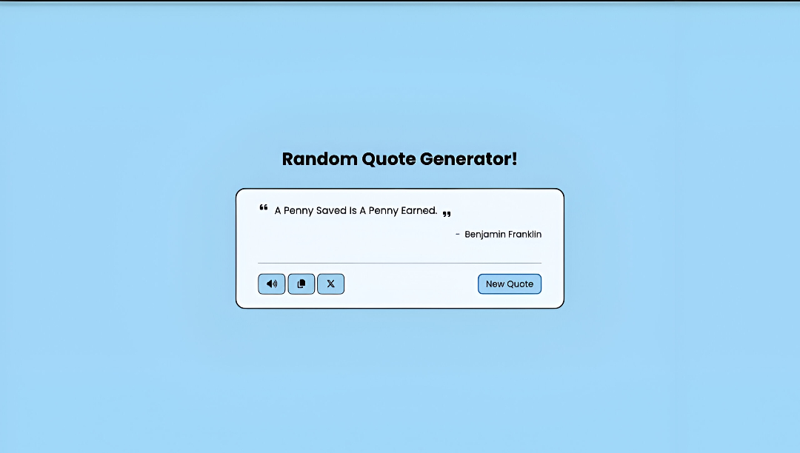

# 🎯 Random Quote Generator

A clean and interactive **Random Quote Generator** built with **HTML**, **CSS**, and **JavaScript**.  
This app fetches quotes from the [DummyJSON Random Quote API](https://dummyjson.com/quotes/random) and displays them instantly.  

With a single click, you can:
- Get a new random quote
- Listen to the quote via text-to-speech
- Copy the quote to clipboard
-  Share it directly to Twitter (X)

---

## ✨ Features

- **Random Quote Generation** — Click the "New Quote" button to instantly fetch and display a random quote.
- **Text-to-Speech** — Press the speaker icon to hear the quote read aloud.
- **Copy to Clipboard** — Copy the quote instantly with one click.
- **Tweet the Quote** — Share your favorite quotes directly to Twitter (X) with the click of a button.
- **Responsive Design** — Works seamlessly across desktop and mobile devices.

---

## 🛠️ Tech Stack

- **HTML5** — Structure of the app
- **CSS3** — Styling and layout
- **JavaScript (ES6)** — App logic and API handling
- **[DummyJSON API](https://dummyjson.com/quotes/random)** — Source of random quotes

---

## 🚀 Live Demo

🔗 [View Live Project](https://yourusername.github.io/random-quote-generator/) *(Update with your link)*

---
